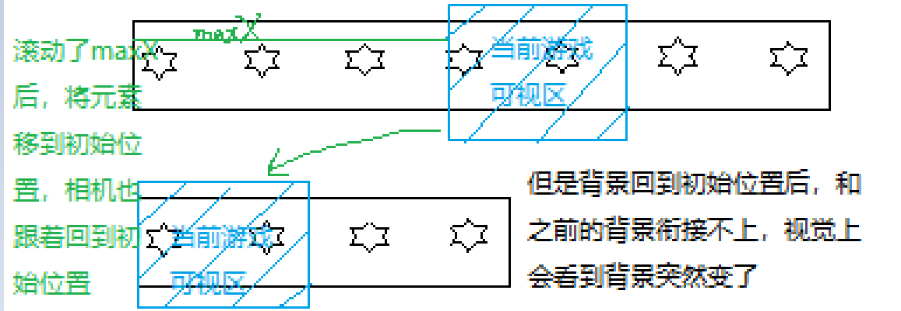

# 学习资源：[Infinite Runner in Phaser 3 with TypeScript](https://blog.ourcade.co/)

## 介绍

Phaser4会用TS编写。

TS有很多优点，在此不做赘述。

## 开始

本教程会做一个叫火箭鼠（Rocket Mouse）的游戏：让游戏角色活着并收集硬币同时避开障碍物

必要条件：Node、TS、Phaser3

模板：[phaser3-typescript-vite-template](https://github.com/ourcade/phaser3-typescript-vite-template)

可以在vite.config.ts中的server中修改域名端口号

npm run start -> http://localhost:8000/

## 重复背景

1. 获取资源
免费资源：[Game Art Guppy](https://www.gameartguppy.com/)

图片资源放在src同级目录下的public里

本项目可以获取免费资源https://www.gameartguppy.com/shop/house-1-repeatable-background/，将下载的Object和Background里所需图片放到public/house里

之后可以通过http://hostname:port/house/imgName.png形式访问图片

2. 修改游戏尺寸

[main.ts](../phaser3-typescript-vite-template/src/main.ts)中调整GameConfig的宽高

3. 创建场景

创建游戏场景：[Game.ts](../phaser3-typescript-vite-template/src/scenes/Game.ts)

4. 将场景添加到游戏中

```ts
import Game from './scenes/Game'

const config: Phaser.Types.Core.GameConfig = {
	// ...,
	scene: [Game], // 可以是一个数组，用来加载多个场景；也可以不是
}
```

通常物体是从中心向外延展的，例如一个轮子，所以设置图片原点在中心点，方便计算移动位置

```ts
// 手动重复加载多张图片铺满背景
this.add.image(0, 0, 'background').setOrigin(0, 0)
this.add.image(0, 0, 'background').setOrigin(-1, 0)
this.add.image(0, 0, 'background').setOrigin(-2, 0)

// 使用TileSprite：使用background重复铺满width、height对应区域
this.add.tileSprite(0, 0, width, height, 'background').setOrigin(0)
```

## 添加火箭鼠

[图片资源](https://www.gameartguppy.com/shop/rocket-mouse-game-art-character/)

角色逻辑：
在地上就会一直跑，
喷气背包有能量就会飞，
在空中会下落且不可再飞，
被镭射炮击中会死

1. 创建精灵图

**动画中通常使用精灵图（sprite sheets）或图表集（atlases），因为在同一图层中切换帧会比直接切换图层更高效**。

使用工具创建精灵图，推荐工具[TexturePacker](https://www.codeandweb.com/texturepacker)，下载后拖动图片到左侧面板

在JSON文件（Data file）和纹理文件（Texture file）中选择输出路径为项目public下的对应文件，本项目输出到/public/characters

2. 加载精灵图

[在游戏场景中加载](../phaser3-typescript-vite-template/src/scenes/Game.ts)

```ts
this.load.atlas(key, png文件, json文件)
```

**sprite sheet和sprite atlas一般可互换，它们都是一张图中包含多个更小的图，phaser中，sprite sheet中每帧图片大小固定，可以用索引访问；sprite atlas是帧与帧之间尺寸不同，可以用类似文件名的字母数字组合名访问**

TexturePacker发布的精灵图符合第二种，所以使用atlas

atlas既可以创建Image也可以创建Sprite，这里因为有动画，所以使用精灵图。

**精灵图可以运行动画，图片不行**

动画由动画管理器创建，并且是全局的，一旦创建，可以被所有场景里的任意精灵图使用

```ts
// 创建动画
this.anims.create({
  key: 'rocket-mouse-run', // 动画名称，必需
  frames: this.anims.generateFrameNames('rocket-mouse', {
    start: 1,
    end: 4,
    prefix: 'rocketmouse_run',
    zeroPad: 2, // 帧数超过9时必需，用来填充名称的，这里表示不足2位时用0填充，
              // 这里也可以去掉这个参数，把上面的prefix改为rocketmouse_run0
    suffix: '.png'
  }),
  // 等同于：
  // frames: [
  //   { key: 'rocket-mouse', frame: 'rocketmouse_run01.png' },
  //   { key: 'rocket-mouse', frame: 'rocketmouse_run02.png' },
  //   { key: 'rocket-mouse', frame: 'rocketmouse_run03.png' },
  //   { key: 'rocket-mouse', frame: 'rocketmouse_run04.png' },
  // ]
  frameRate: 10, // 动画速度
  repeat: -1 // -1代表无限循环
})

// 运行动画
this.add.sprite(
      // ...
    ).play('rocket-mouse-run') // 精灵图.play(动画名称)
```

## 预加载与枚举

1. 创建预加载场景，加载资源

因为在游戏场景里创建跑、飞、落、死4种动画，会让代码更复杂，可以创建一个预加载场景，在这里创建动画，因为动画是全局的，所以游戏场景里也能使用

创建一个[预加载场景](../phaser3-typescript-vite-template/src/scenes/Preloader.ts)，里面加载资源，资源加载完再加载游戏场景

然后将这个预加载场景添加到main.ts里，注意**phaser会自动加载scene数组中的第一个**，这里需要把Preloader放首位

2. 创建动画

枚举：ts有js没有、在编辑器（vscode）里用枚举会有代码提示、可读性强等

可以创建一些如场景名称、动画名称等枚举变量用来管理多个名称，可以使用代码提示并防止写错

## 运行与滚动

在让角色运动前需要添加一个物理引擎，让角色可以落下，但是要加边界防止角色无线下落

可以设置角色运动速度setVelocity，当角色动起来，可以设置相机跟随角色，以免角色跑出视角。

为了防止角色走出背景进入一片漆黑，可以让背景不随相机滚动：
```ts
privite background!: Phaser.GameObjects.TileSprite

this.background = this.add.tileSprite(0, 0, width, height, TextureKeys.Background)
    .setOrigin(0)
    .setScrollFactor(0, 0) // 设置背景不随相机滚动，但是因为背景不变，这样角色看起来就像在原地运动

// 相机视角每帧都在变，每次更新需要设置tileSprite的位置
// 将背景存储在私有变量中，在update()中更新其位置到相机当前滚动的位置
update(t: number, dt: number) { // t: 游戏start至今的总时间；dt：上一帧到当前的时间
  this.background.setTilePosition(this.cameras.main.scrollX)
}
```

## 装饰房间

[资源](https://www.gameartguppy.com/shop/house-1-repeatable-background/)

当添加装饰物较多时，可能会有遮挡问题，可以检查两者之间的位置，如果有重叠，则只显示其一

## 添加喷气式背包

Phaser3的GameObjects没有children属性。如果希望将一些图片等作为某个对象的子元素，可以创建一个继承Phaser.GameObjects.Container类的子类，因为Container有children

```ts
class RocketMouse extends Phaser.GameObjects.Container {
  constructor(scene: Phaser.Scene, x: number, y: number) {
    super(scene, x, y);

    // 创建精灵图
    const mouse = scene.add.sprite(0, 0, TextureKeys.RocketMouse)
      .setOrigin(0.5, 1)
      .play(AnimationKeys.RocketMouseRun);

    // 将mouse作为child添加到RocketMouse
    this.add(mouse)

    // Container的children默认没有物理引擎，可以添加一个
    scene.physics.add.existing(this)
  }

}
```

Container内的元素会被Container的位置影响，可以在main.ts中打开debug，查看情况

Container原点默认在其左上角，里面的子元素如果设置了原点，则是相对这个Container的原点，可能需要再给子元素设置位移

喷气式火焰还需要开关，这里获取键盘实例，根据空格键是否按下，设置元素的visible。

另外还要设置飞行、下落等动画

## 添加一个激光障碍物
1. 创建

由于激光障碍是由上中下几个元素组成的，所以也[用Container创建](../phaser3-typescript-vite-template/src/game/LaserObstacle.ts)

然后重复创建障碍，设置位置随机。目前障碍物在即将滚出界面前会先消失，因为这个障碍物现在的宽度为0，需要添加 physics body，然后设置物体尺寸等。

因为老鼠可能会撞上障碍物，而我们不希望障碍物会被撞飞，所以可以将障碍物设置成静态物体static body
```ts
scene.physics.add.existing(this, isStatic)
```
2. 重复移动
**静态物体不受重力影响，不会被其他物体推动**，但是移动其children，静态物体不会移动，需要手动设置position
```ts
private wrapLaserObstacle() {
  const scrollX = this.cameras.main.scrollX
  const rightEdge = scrollX + this.scale.width

  const body = this.laserObstacle.body as Phaser.Physics.Arcade.StaticBody

  let width = body.width
  if (this.laserObstacle.x + width < scrollX) {
    this.laserObstacle.x = Phaser.Math.Between(
      rightEdge + width,
      rightEdge + 1000
    )
    
    this.laserObstacle.y = Phaser.Math.Between(0, 300)
    body.position.x = this.laserObstacle.x + body.offset.x
    body.position.y = this.laserObstacle.y
  }
}
```
3. 监听碰撞
游戏中，障碍物是危险的，可以监听碰撞：
```ts
this.physics.add.overlap(target, [bodies], [overlapCallback], [processCallback], [callbackContext])
// 当bodies与target相交时，会调用overlapCallback，接收两个相交的物体，并且overlap方法会返回true
// processCallback如果提供了，则会接收相交的两个物体，并返回一个布尔值，如果返回true则两个相交物体会被传递给overlapCallback
// 这两回调函数的参数：function(bodyA一般为target, bodyB, collisionInfo会包含角度、深度等信息)
```

4. 角色死亡
设置游戏角色的不同状态，死亡如果是一个过程，可以慢慢减速，然后停止

## 游戏结束和重玩

1. 创建场景
创建一个平行于游戏场景的[游戏结束场景](../phaser3-typescript-vite-template/src/scenes/GameOver.ts)，里面可以放一些如分数、暂停、弹窗等UI显示。

文字样式设计可以使用[phaser3-text-styler](https://ourcade.co/tools/phaser3-text-styler/)网站。

2. 监听角色死亡

可以在角色状态改变为死亡时，停止游戏，然后监听键盘事件，在指定键按下时重玩游戏

方法一：直接在状态改变的地方监听键盘事件（在角色类中修改场景）

方法二：状态改变后触发角色死亡事件，在游戏场景监听角色死亡事件并控制场景切换（在场景类中修改场景）

另外，结束并重新开始场景的方法：
```ts
// 方法一
this.scene.stop(SceneKeys.Game)
this.scene.start(SceneKeys.Game)
// 方法二
this.scene.restart()
```

## 添加硬币并收集

本游戏得分：收集硬币、角色跑出的距离

1. 加载硬币图
2. 创建多个硬币

Phaser Group可以创建一组能循环使用的GameObjects，使用group创建硬币，当硬币掉落屏幕外也不需要销毁重新创建。

staticGroup静态组，创建的元素不受重力影响，可以漂浮在空中。

3. 周期性创建硬币

问题：硬币的body还在原来的位置

解决：updateFromGameObject() // 更新body到硬币当前visible的位置 

## 飞向无限

设置物理世界的边界
```ts
this.physics.world.setBounds(
  x, y,
  width, height
)
// 当游戏角色跑出的距离达到width，就只能原地踏步，不能再前进了（角色设置了碰撞边界setCollideWorldBounds(true)）
```

可以设置一个距离，超过这个距离就回到原点，在视觉上达到可以无限奔跑的效果。

设置一个无缝传输：当滚动到一个指定位置maxX时，向后移动所有创建的GameObjects

问题1：背景使用TileSprite平铺背景，传输火箭鼠后修改其位置，让其回到初始位置，但是让背景减去maxX达不到效果

（相机跟随老鼠，当滚动距离超过maxX，老鼠回到初始位置，相机也是，背景平铺位置会随相机位置移动）

（猜测应该是这样的：）


解决办法一：创建4张背景图，然后随着屏幕滚动循环平铺

解决方法二：设置maxX为背景图宽度的倍数

问题2：硬币会突然消失

原因：指定在滚动到第二个书架位置创建硬币，可能当时上一组硬币还在，这是创建硬币的方法会把当前位置硬币隐藏，然后修改位置为边界外随机位置。

解决：在无缝传输时创建硬币（或修改硬币位置）


Phaser3.5允许单个精灵图用指定动画或者本地动画，所以可以创建全局动画供任意精灵图使用